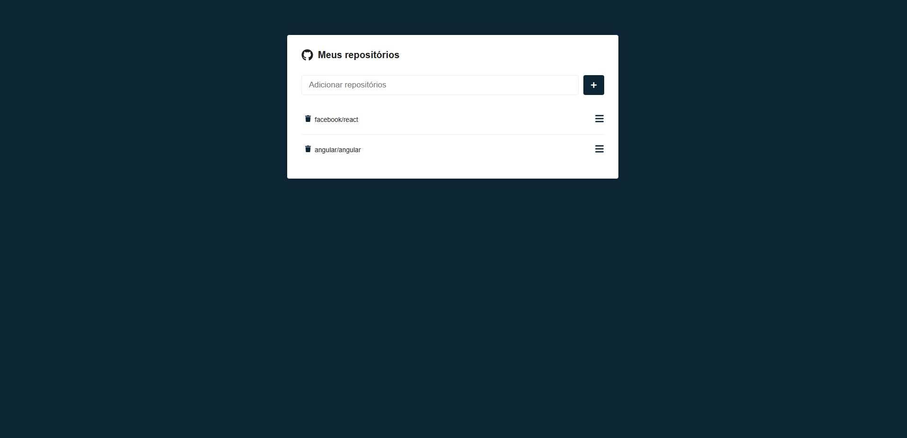
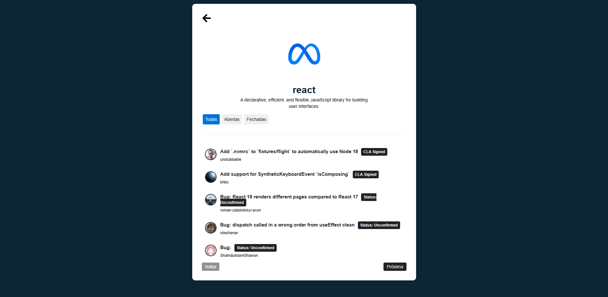

<h2 align="center">Requisição de Repositórios GitHub</h2><br>

### 🔖 Sobre

---

O projeto **Requisição de Repositórios GitHub** é um site que foi criada através do curso **React do Zero ao Avançado**. O intuito é você pesquisar diretórios existentes no GitHub, salvá-lo no LocalStorage e exibi-los detalhadamente através de requisições API utilizando a biblioteca **Axios**.<br><br>

### 🚀 Tecnologias utilizadas

---

O projeto foi desenvolvido utilizando as seguintes tecnologias

-   [React](https://pt-br.reactjs.org/) <br><br>

### 🖥️ Screens

---

Tela inicial:
<br><br>
Tela de detalhes do repositório:
<br><br>

### 😎 Publicado no Netlify

---

[](https://app.netlify.com/sites/repgithub/deploys)<br><br>

### 🔽 Possui

---

-   ✅ Cadastro de repositório;
-   ✅ Requisição feita com Axios para buscar repositórios no GitHub;<br><br>

### 🤵 Autor

---

Desenvolvido com 💙 por Bruno Pereira.

[](https://www.instagram.com/brunopemelo/)
[](https://www.facebook.com/brunopemelo)
[](https://wa.me/5535987171280)
[](https://www.linkedin.com/in/brunopemelo)

```

```
